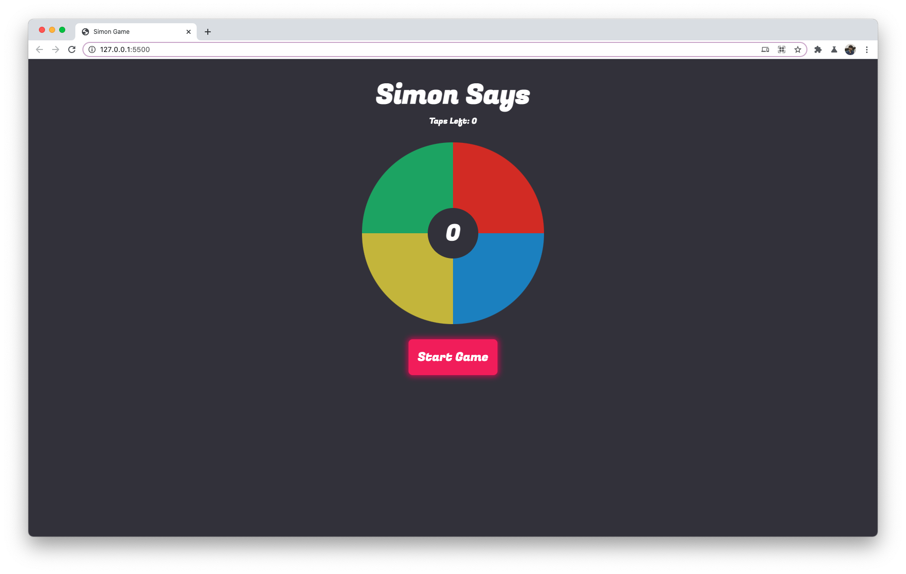

# simon-game
An implementation of simon game using HTML, CSS, JS.

## Typography

### Font
- Fugaz One

## Colors

### Primary
- Greyish: #393843
- Red: #f52e16
- Pinkish Red: #e91e63, #ad1457
- Blue: #38a0eb
- Yellow: #ece02e
- Green: #3ecb74

# Steps followed
- First try to create the board with 2 colors on top and 2 on bottom.
- Since the players need to click on each color, used button as responsive element and gave them background color in order of RED, BLUE, PURPLE, GREEN.
- We can use any method to create the defined structure I Just divide in 50% so 2 colors on top and 2 on bottom in board container.
- Now we need to create two text elements that will keep trakc of current score and number of taps left. We will given them id's to reference them in code.
- Now we will create a button that will start the game, so give it a id that we can use for reference.
- Now we need to style the buttons to have the glowing effect on click.
- Now lets add the logic to the game.
- First we will reference all the button, score and tapCount element from the document into code.
- We will create a variable that will keep the color combination so that we can get single color randomly from it.
- We will create a helper function that will selected a color character and return to us.
- Now we will create a gloabl variable that will keep track of word formed so far, which users have to guess.
- We can even shuffle the above word if we don't want to form a continous sequence.
- Now for selected word play the animation that will be shown to user which they have to repeat.
- Once the animation is played we will update the tapCount remaining variable.
- Now we will just wait for the click event on the buttons and for each tap we will update the tapCount.
- We will also check if the tapCount is equal to the length of chosen string.
   - If string formed using color tap is equal to string chosen, we will update the score and give feedback.
   - Else we will just give feedback that you couldn't guess the pattern.

